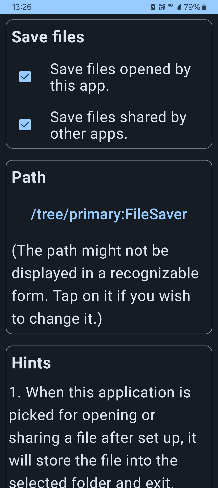

# File Saver

File Saver is an app that does one simple thing: it opens files provided by other apps and save them into a folder the user picked. This works on devices running Android.

Recently, many apps allow opening files with another app, but don't offer the option to save the file into shared storage. Some do provide such an option, but require too much permission for doing that.

Although it's really good to have apps managing files (and securing user data) for us, some people still like to manage files by themselves. In addition, app-specific files usually cannot be accessed by the system picker (unless the app has a `DocumentsProvider`), so you can hardly upload them to a website or cloud storage. The purpose of this app is to copy these files into shared storage, so they can be easily selected and can be managed.

## Screenshot

## How it works

This app allows the user to pick a directory using the system picker, and then the user should grant the (persistable) permission to manage files under the directory. After that, when this app is selected for opening a file, it'll save the file under the directory that is previously picked. This app accesses files and directories through the Storage Access Framework, so it doesn't have to explicitly declare a permission.